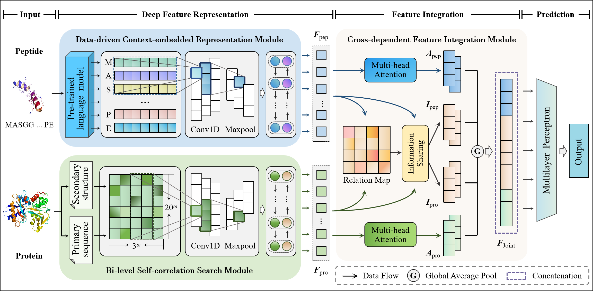

## DeepPepPI: a deep cross-dependent framework for predicting peptide-protein interactions in plants

This repository contains the source code and benchmark datasets used in this paper.

## Introduction

Motivation:&#x20;

Peptide-protein interactions (PepPIs) play a crucial role in various fundamental biological activities in plants. Due to the disadvantages of biological experimental technologies such as time-consuming and labor-intensive, it is indispensable to develop computational methods for identification of PepPIs. However, less attention has been paid to represent the pair-wise interaction information between peptides and proteins in existing methods, limiting the prediction performance.

Results:

In this paper, we propose DeepPepPI, a novel deep cross-dependent framework for accurate prediction of plant PepPIs. Concretely, a data-driven context-embedded representation (DCR) module and a bi-level self-correlation search (BSS) module are constructed to portray the contextual semantic information of peptides and intrinsic properties of proteins, respectively. To incorporate peptide and protein deep-level representations, a cross-dependent feature integration module is developed to bridge the gap between the BSS and DCR modules from a global perspective. Comprehensive experiments demonstrate that the proposed method achieved excellent prediction performance and powerful generalization capability, which can serve as an effective and convenient tool for the characterization and identification of PepPIs.

## DeepPepPI



## Dataset

In this paper, the initial plant PepPI datasets were extracted from the widely used STRING database, in which the sequences with no more than 100 amino acid residues were identified as peptides. For positive samples, the interactions between peptides and proteins were filtered by setting a cut-off value greater than 950 for the “combined\_score” to reduce the number of false positives. Besides that, we constructed the negative set by randomly shuffling the non-interacting pairs of peptides and proteins, meaning that there were no records of their “combined\_score” in STRING database. For training and evaluating the prediction performance of DeepPepPI, we randomly picked up 80% of the samples as the training datset and the remaining samples were taken as the independent testing dataset to ensure that there was no systematic difference between training and independent testing samples.

*   Species: *Arabidopsis thaliana* (BD1) and *Solanum lycopersicum (BD2)*.

##### peptide embedding features:&#x20;

We introduce ProtT5-XL-UniRef50 (ProtT5) to capture the contextual information of peptide sequences, which can be available at [https://github.com/agemagician/ProtTrans](https://github.com/agemagician/ProtTrans).

##### protein secondary structure:

The SOPMA web server (<https://npsa-prabi.ibcp.fr/cgi-bin/npsa_automat.pl?page=npsa%20_sopma.html>) is used to predict protein secondary structures consisting of three classical conformational states: α-helix (H), β-sheet (E) and coil (C)..

### Setup and dependencies

*   Python 3.7

*   Keras >\= 2.10.0

*   TensorFlow >\= 2.10.0

*   Numpy

*   Scikit-Learn

### Code details

*   DeepPepPI.py: train and evaluate the model.

*   DeepPepPI\_modules.py: DeepPepPI model.

*   multi\_head\_att.py: multi-head self-attention mechanism.

*   load\_data.py: data importing and processing.

*   test\_scores.py: performance calculation.

```python
python DeepPepPI.py
```

## Citation

Zhaowei Wang, Jun Meng, Qiguo Dai, et al. "DeepPepPI: a deep cross-dependent framework for predicting peptide-protein interactions in plants."   (2023) \[*Under Review*]
